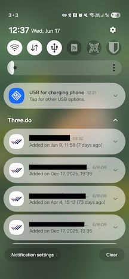
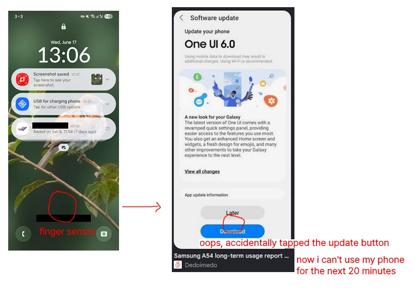
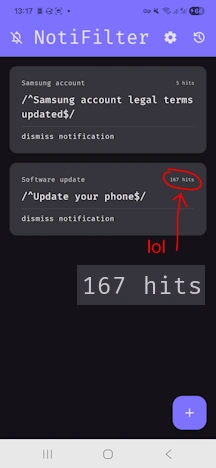
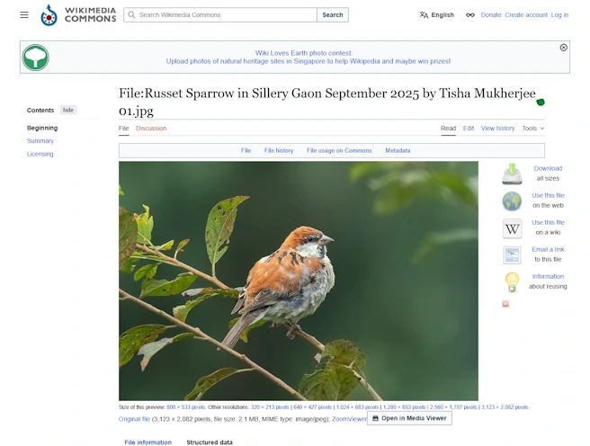
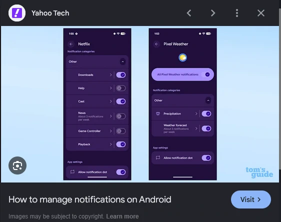
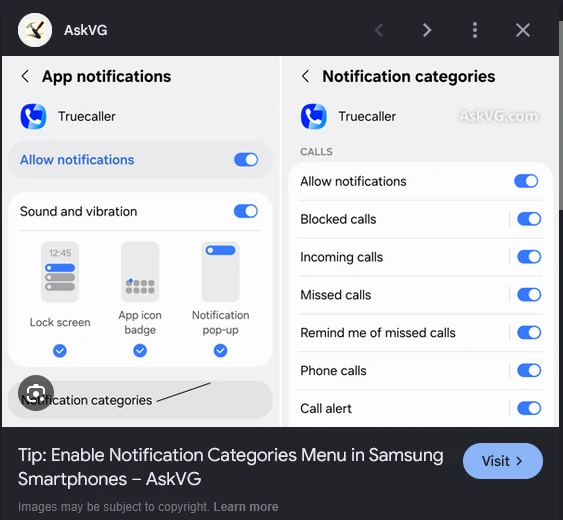
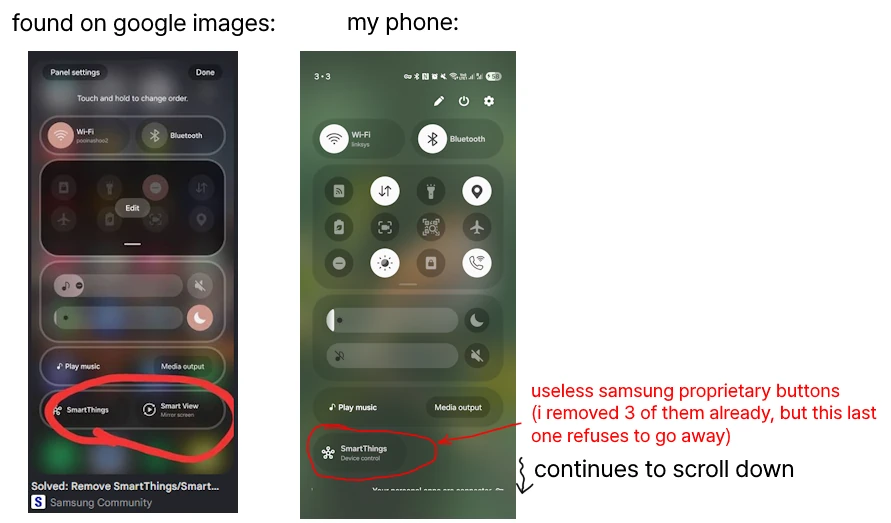

+++
title = "I Dislike OneUI"
date = "2026-06-17T12:28:36+08:00"

#
# description is optional
#
# description = "An optional description for SEO. If not provided, an automatically created summary will be used."

tags = ["technology"]
+++

I grew up on cheap Chinese phones where I flashed CyanogenMod to get rid of all the bloat.

It's been getting harder and harder for custom ROM users with all the Google Play Store integrity bullshit and banking apps refusing to load, so I decided to switch to the most average and non-technical phone I could get - the Samsung S25.

However, Samsung's OS "OneUI" is honestly just terrible. It's so bad that I'm tempted to buy a 2nd hand old phone just to flash LineageOS instead.

## The good

The camera is decent I guess. The ultrawide and telephoto cameras are new to me, and I've found surprisingly some uses for them.

Battery life is good too. Not much to complain here.

## The bad

All the bad is purely on the software side. This is an incomplete list since I can't recall every OneUI annoyance right now, I'll update the list as I continue to remember / encounter issues.

### OneUI silently deletes your notifications

I use an old app called Three.do as a task list, it shows all my tasks as notifications so I can see them whenever I pull down my notifications.

Since switching to OneUI, I'm randomly getting "Task snoozed for 5 minutes" toast popups while using my phone. That toast appears when a Three.do task notification gets dismissed (swiped away).

I didn't dismiss any task notifications.

i.e. **OneUI is randomly deleting my notifications.**

This has never happened in all of my previous phones. They all used some variation of stock Android (CyanogenMod / LineageOS).

My guess is OneUI uses a time limit for each notification - when a notification stays too long (1-2 days) then OneUI automatically deletes the notification.

I've searched for settings and looked online for solutions, but no one is even talking about this.

### The "Software Update" screen is aggressively shown, to the point that you might accidentally update by mis-tapping the screen

Here is a recreation of an actual experience I had with OneUI:

1. I got a message from a friend
2. I unlock my phone, I tap the screen multiple times (the fingerprint scanner is dodgy because Samsung)
3. The update screen appears out of nowhere
4. I accidentally tap "Update", placed conveniently right at the fingerprint scanner location
5. My phone starts updating for the next 20 minutes, I can't respond to my friend

This has happened at least 3 times by now.

Unlocking the phone may bring you **immediately** to a software update screen. This is completely random and inconsistent, that you can't predict when the update screen will show up.

I've since installed [NotiFilter](https://github.com/BURG3R5/NotiFilter) to dismiss the update notifications. Since then, the update screen has only appeared once (which I've luckily didn't tap by accident).

### You cannot set a scrolling wallpaper

I recently discovered the WikiMedia Commons page, where you can find many beautiful photos. I've found [this photo of a sparrow](https://commons.wikimedia.org/wiki/File:Russet_Sparrow_in_Sillery_Gaon_September_2025_by_Tisha_Mukherjee_01.jpg) which I thought would make a nice phone wallpaper.

Since the photo is in landscape orientation, obviously I should make this a **scrolling wallpaper**, meaning when I scroll through apps on my home screen, the wallpaper would also scroll horizontally.

Well...

- [Why is no-one talking about the scrolling wallpaper feature?](https://www.reddit.com/r/oneui/comments/1jpqpu3/why_is_noone_talking_about_the_scrolling/)
- [Why was the scrolling wallpaper feature removed in the first place?](https://r1.community.samsung.com/t5/galaxy-s/why-was-the-scrolling-wallpaper-feature-removed-in-the-first/td-p/36080834)
- [Oneui doesn't support wallpaper scrolling, a workaround to simulate the same behaviour is the only plausible option but it os extremely buggy right now](https://www.threads.com/@_peace_among_us_/post/DTTJNZcgt4f/oneui-doesnt-support-wallpaper-scrolling-a-workaround-to-simulate-the-same)

Samsung is the only company capable of making me spend a whole hour trying to set a scrolling wallpaper, and actually fail at it.

### Notification categories is hidden by default (and they made it annoying to use)

Apps like Instagram are constantly spewing notifications that are thinly-veiled ads or user engagement bait.

If you want to disable these within the Instagram app, all you need to do is go through 6 pages of settings, each containing 10-20 sliders that may / may not disable one specific type of advertising notification. You should also make sure not to accidentally disable real notifications like chat DMs or post comments. Also, these settings are **per-account** - if you are logged into multiple Instagram accounts, you need to update the 50+ slider settings for every account individually.

Luckily, newer Android versions have a "notification categories" feature:

These let you control what type of notification to show **per-app**. Coming from LineageOS, this was a god send. No more wading through Instagram's shitfilled UI designed to disincentivize disabling CEO-unfriendly settings and maximise user engagement.

**Samsung disables this feature by default.**

The setting to enable this is buried under: "Settings" > "Notification" > "Advanced settings" > "Manage notification categories for each app"

Even after that, Samsung makes yet another UI decision to discourage using notification categories -

In stock Android (see the screenshot above), the categories are **immediately available** right in the app settings page. You tap-hold an app, click on its settings, then boom, here are the categories.

In OneUI, the categories are hidden at the bottom in a "Notification categories" button:

You tap-hold an app, click on its settings, scroll to the bottom, tap on "Notification categories", then finally you get to see the categories.

This seems like a very minor change, but any UX/UI designer will tell you how much of an impact this has on user behaviour. Just the fact that the categories aren't immediately visible upon opening the settings already affect what settings users might try to change.

### The "Quick Actions" panel has so much bloat that it creates a scrollbar

This one just shows how little attention the Samsung folks give about their own phone's UI.

To reach the "quick actions" panel, you swipe down **twice** - **(1)** open the notification panel, then **(2)** open the quick actions panel.

However, the quick actions panel has so much Samsung bullshit that the panel has a scrollbar to scroll through all the features Samsung wants you to use. So:

To leave the "quick actions" panel, you swipe up **three times** - **(1)** scroll to the bottom of the "quick actions" panel, then **(2)** exit "quick actions" and reach notifications panel, then **(3)** exit notifications panel (if you have no notifications).

These buttons (e.g. "SmartThings") aren't features at all, they're ads trying to silently suggest "hey you should give our proprietary features a try pls pls pls pls pls". You can't get rid of them, these buttons will always be in your face whenever you change screen brightness, switch WiFi connections or toggle hotspot.

Samsung wants to become a walled garden just like Apple so bad that they're constantly pushing Samsung exclusive features that are honestly just useless.
