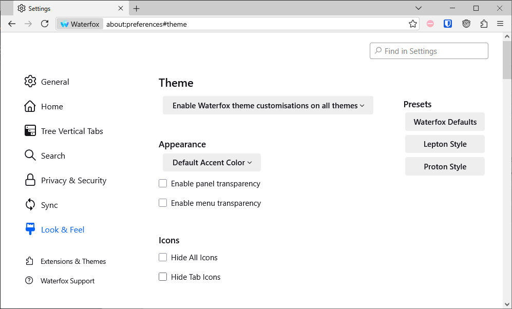
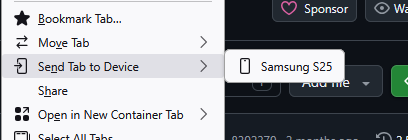

+++
title = "Let's switch to Waterfox"
date = "2026-06-10T17:47:08+08:00"
tags = ["technology","ui",]
+++

I've been fed up with Firefox ever since they added yet more padding to their UI, and now they seem to be more interested drawing furry bait than making sensible UI decisions.

Firefox had removed [basic connection error codes](https://www.reddit.com/r/firefox/comments/1s4zoj3/new_firefox_doesnt_show_connection_error_codes/) (fixed now), [make tabs unnecessarily animated which I absolutely despise](https://connect.mozilla.org/t5/discussions/the-new-tab-mute-button/m-p/89531) (still not fixed), pushed half-baked and questionable experiments like the AI chat sidebars, AI link previews, and many more I can't remember right now.

Granted a few of these were reversed, but I feel like a beta tester for some company chasing trends, playing whack-a-mole with looking up `about:config` settings every update, until they eventually deprecate and remove those settings and say "well the settings have been deprecated for years now, you weren't supposed to use them". We all know that compact mode will be removed by Firefox at some point.

With the latest Firefox update, [black7375's Firefox-UI-Fix theme](https://github.com/black7375/Firefox-UI-Fix) is broken again, and their repo seems to be basically unmaintained. So I decided to give Waterfox a go.

## How is Waterfox?

It's surprisingly good.

First, **it uses the Firefox-UI-Fix theme by default**. It even comes with a dedicated settings page for the theme: (I am using [this color theme on Mozilla addons](https://addons.mozilla.org/en-US/firefox/addon/microsoft-edge-light))



I'd thought sending tabs to my phone was a Firefox proprietary feature, but here it is alive and well in Waterfox:



Firefox's sync features all work too, I synced my bookmarks and everything perfectly fine.

~~It comes with a built-in ad blocker. I'm not sure if it's based on uBlock origin, but it accepts the same filter syntax as uBlock origin and I had no problems copying my existing filters to Waterfox.~~

Waterfox has a built-in ad blocker, but I've decided to use uBlock origin anyway. The built-in blocker has no way to "select" an element on the page and remove it, I have to manually write a filter following the syntax, which is quite annoying. I also want to be up-to-date on adblock via the official addon rather than through Waterfox's browser updates.

However, some UI problems still got inherited from Firefox. I still needed to create a `chrome/userChrome.css` to tweak the UI, but it's fairly few and only has targeted changes. Here is my entire `userChrome.css` file:

```css
/* 2025-03-09 shitty tab mute animation shit */

/* https://old.reddit.com/r/FirefoxCSS/comments/1j4f0hs/how_to_stop_this_new_tabshrink_animation_when_a/ */
/* https://github.com/Aris-t2/CustomCSSforFx/issues/755 */
/* prevent audio playing tabs from modifying tab width */
.tabbrowser-tab {
  &:is([muted], [soundplaying], [activemedia-blocked]) {
      #tabbrowser-tabs[orient="horizontal"] &:not([pinned]) {
          --tab-min-width: unset !important;
          min-width: var(--tab-min-width-pref, var(--tab-min-width)) !important;
      }
  }
}

/* Enable option to edit bookmark URLs under Add Bookmark (blue star) menu */

.editBMPanel_locationRow {
  display: initial !important;
}


/* Disable Email Image/Audio/Video and Set as Desktop Background context menu items */

#context-sendimage,
#context-sendvideo,
#context-sendaudio,
#context-sep-setbackground,
#context-setDesktopBackground {
  display: none !important;
}
```

As a sidenote, I also have `about:config` settings that I always set, so I have a `user.js` file to force these settings:

```js
// disable download button timer
user_pref("security.dialog_enable_delay", 0);

// open links in last touched window
user_pref("widget.prefer_windows_on_current_virtual_desktop", false);

// insert tabs after current tab
user_pref("browser.tabs.insertAfterCurrent", true);

// fuck you pocket
user_pref("extensions.pocket.api", "3");
user_pref("extensions.pocket.enabled", false);
user_pref("extensions.pocket.loggedOutVariant", "3");
user_pref("extensions.pocket.oAuthConsumerKey", "3");
user_pref("extensions.pocket.onSaveRecs", false);
user_pref("extensions.pocket.onSaveRecs.locales", "3");
user_pref("extensions.pocket.showHome", false);
user_pref("extensions.pocket.site", "3");

// best scrolling
user_pref("general.smoothScroll.currentVelocityWeighting", "0");
user_pref("general.smoothScroll.mouseWheel.durationMaxMS", 250);
user_pref("general.smoothScroll.stopDecelerationWeighting", "0.82");
user_pref("mousewheel.min_line_scroll_amount", 25);

// don't clear selection when clicking middle mouse button
user_pref("general.autoscroll.prevent_to_collapse_selection_by_middle_mouse_down", true);

// show compact mode
user_pref("browser.compactmode.show", true);

// don't popup the download panel after downloading a file
user_pref("browser.download.alwaysOpenPanel", false);

// restore download confirmation dialog
// i.e. "always download" or "open with"
user_pref("browser.download.improvements_to_download_panel", false);
```

## Migrating

I have literally thousands of open tabs and multiple windows, that's just how I use my browser.

I first used Waterfox's built in "Import Data" button, but that only transferred my bookmarks, history and etc.

To migrate open tabs, I found this community answer https://support.mozilla.org/en-US/questions/1313272 and copied it here in case it somehow disappears in the far future:

```
You can copy certain files with Firefox closed to the current profile folder to transfer or recover personal data.
Note that best is to avoid copying a full profile folder.
Note that you should be cautious with copying SQLite database files if you previously had problems.

- bookmarks and history: places.sqlite
- favicons: favicons.sqlite
- bookmark backups: compressed .jsonlz4 JSON backups in the bookmarkbackups folder
- cookies.sqlite for the Cookies
- formhistory.sqlite for saved autocomplete Form Data
- logins.json (encrypted logins;32+) and key4.db (decryption key;58+) for Passwords saved in the Password Manager
- key3.db support ended in 73+; to use key3.db in 58-72, make sure to remove key4.db
- cert9.db (58+) for (intermediate) certificates stored in the Certificate Manager
- persdict.dat for words added to the spell checker dictionary
- permissions.sqlite for Permissions and possibly content-prefs.sqlite for other website specific data (Site Preferences)
- sessionstore.jsonlz4 for open tabs and pinned tabs (see also the sessionstore-backups folder)
```

If you are feeling annoyed by Firefox's decisions, give Waterfox a try!
